# TP — Partitionnement (Sharding) sous MongoDB (Docker)

**Auteur :** *[Nom Prénom]*  
**Groupe :** *[Groupe]*  
**Date :** *[JJ/MM/AAAA]*  

---

## 1. Objectif du TP

L’objectif de ce TP est de mettre en place une architecture **MongoDB shardée** (partitionnée), puis de vérifier son bon fonctionnement.  
Le cluster construit est composé des éléments suivants :

- **1 serveur de configuration (Config Server)** : conserve les métadonnées du sharding (répartition des chunks, configuration du cluster, etc.).
- **2 shards** : stockent réellement les données (chaque shard est initialisé en **replica set**, conformément aux bonnes pratiques).
- **1 routeur `mongos`** : point d’entrée du cluster shardé, chargé de router les requêtes vers le shard approprié.

À la fin, le sharding est activé sur une base de données et une collection est shardée avec une clé de sharding.

---

## 2. Rappels et principes

### 2.1. Rôle des processus
- **`mongod`** : processus serveur MongoDB (stockage + moteur de base de données).  
  Un `mongod` doit rester en exécution pour que le service soit disponible.
- **`mongo`** (shell) : client en ligne de commande permettant d’exécuter des commandes sur un serveur.
- **`mongos`** : routeur du sharding. Les clients s’y connectent (et non directement aux shards).

### 2.2. Organisation des terminaux
Plusieurs processus devant fonctionner simultanément, l’exécution est répartie sur plusieurs terminaux afin de séparer les logs et les rôles :

- **T0 — Setup** : préparation (réseau Docker, volumes)
- **T1 — ConfigSvr** : serveur de configuration (processus `mongod`)
- **T2 — Shard1** : processus `mongod` du shard 1
- **T3 — Shard2** : processus `mongod` du shard 2
- **T4 — Mongos** : routeur `mongos`
- **T5 — Client** : terminal d’administration (`docker exec` + `mongo shell`)

> Remarque : les intitulés T0..T5 sont des repères d’organisation (fenêtres/onglets de terminal), il ne s’agit pas de terminaux “MongoDB” spécifiques.

---

## 3. Mise en place du cluster shardé (Docker)

> **Pré-requis :** Docker installé et fonctionnel.  
> **Image utilisée :** `mongo:4.2.24`

### 3.1. Étape 0 — Préparation (réseau + volumes) — *T0*
**But :**  
- Créer un réseau Docker dédié pour que les conteneurs puissent communiquer par nom DNS.
- Créer des volumes pour conserver les données sur disque (persistant).

**Commandes :**
```bash
docker rm -f mongos configsvr shard1 shard2 mongodb 2>NUL
docker network rm mongo-shard-net 2>NUL
docker volume rm configsvrdb shard1db shard2db 2>NUL

docker network create mongo-shard-net
docker volume create configsvrdb
docker volume create shard1db
docker volume create shard2db
```

**Résultat attendu :**
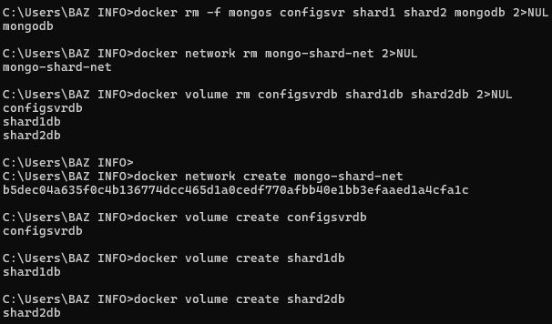
- Création d’un réseau `mongo-shard-net`
- Création des volumes `configsvrdb`, `shard1db`, `shard2db`

---

### 3.2. Étape 1 — Démarrage du Config Server — *T1*
**But :**  
Lancer le serveur de configuration qui conserve les métadonnées du sharding.

**Commande :**
```bash
docker run -it --rm --name configsvr --net mongo-shard-net -p 27019:27019 \
  -v configsvrdb:/data/db mongo:4.2.24 \
  mongod --configsvr --replSet replicaconfig --port 27019 --bind_ip_all
```

**Résultat attendu :**
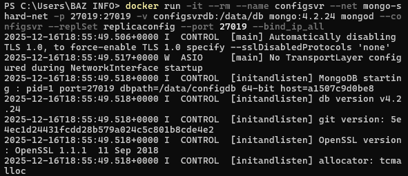
- Logs du serveur
- Message indiquant l’attente de connexions sur le port `27019`

---

### 3.3. Étape 2 — Initialisation du replica set du Config Server — *T5*
**But :**  
Le Config Server doit être en **replica set** (exigence MongoDB pour le sharding), même s’il n’y a qu’un seul nœud.

**Connexion :**
```bash
docker exec -it configsvr mongo --port 27019
```
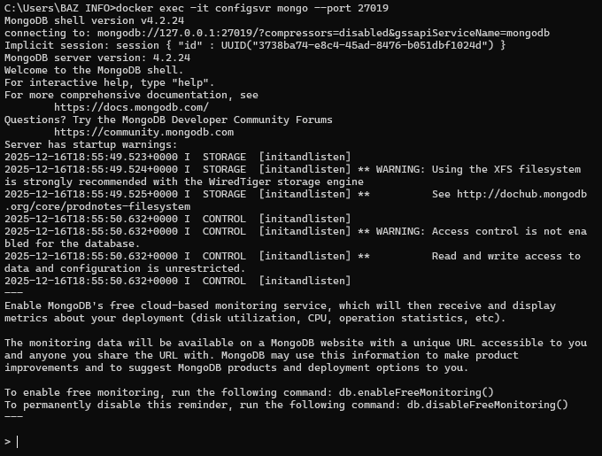

**Initialisation :**
```js
rs.initiate({
  _id: "replicaconfig",
  configsvr: true,
  members: [{ _id: 0, host: "configsvr:27019" }]
})
```
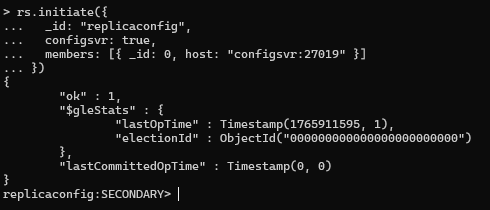

**Vérification :**
```js
rs.status()
```
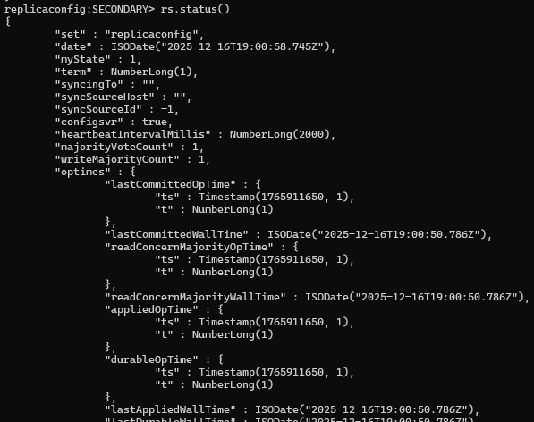

**Résultat attendu :**
- Le membre `configsvr:27019` apparaît avec `stateStr: "PRIMARY"`.
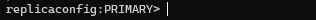

Sortie :
```js
exit
```

---

### 3.4. Étape 3 — Démarrage du Shard 1 — *T2*
**But :**  
Lancer le premier shard, qui stockera une partie des données.

**Commande :**
```bash
docker run -it --rm --name shard1 --net mongo-shard-net -p 20004:20004 \
  -v shard1db:/data/db mongo:4.2.24 \
  mongod --shardsvr --replSet replicashard1 --port 20004 --bind_ip_all
```

**Résultat attendu :**
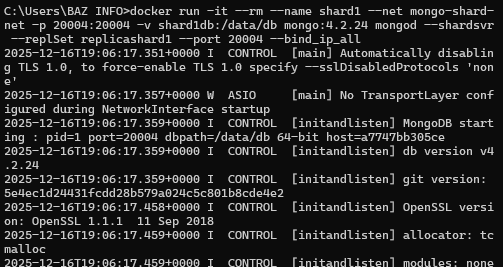
- Logs du serveur
- Attente de connexions sur le port `20004`

---

### 3.5. Étape 4 — Initialisation du replica set du Shard 1 — *T5*
**But :**  
Initialiser le shard 1 en replica set (architecture standard d’un shard).

**Connexion :**
```bash
docker exec -it shard1 mongo --port 20004
```
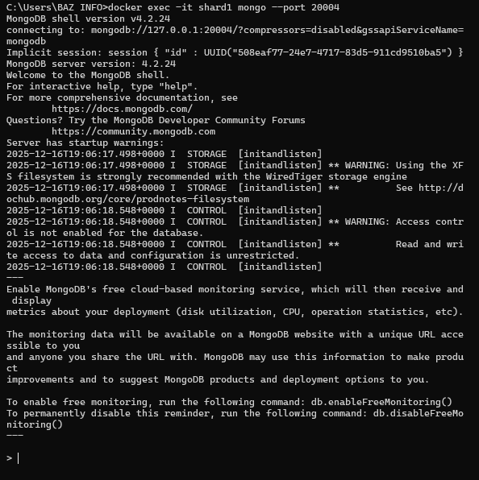


**Initialisation :**
```js
rs.initiate({
  _id: "replicashard1",
  members: [{ _id: 0, host: "shard1:20004" }]
})
```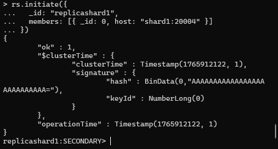


**Vérification :**
```js
rs.status()
```
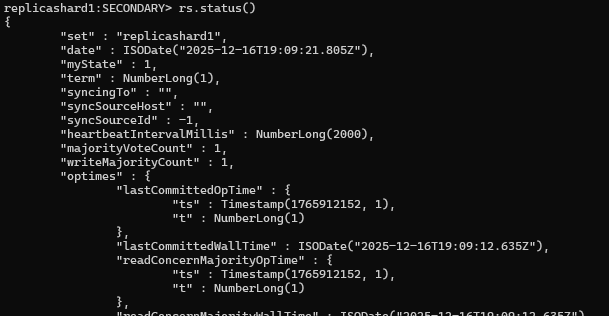

**Résultat attendu :**
- `stateStr: "PRIMARY"` pour `shard1:20004`.


Sortie :
```js
exit
```

---

### 3.6. Étape 5 — Démarrage du Shard 2 — *T3*
**But :**  
Lancer le second shard.

**Commande :**
```bash
docker run -it --rm --name shard2 --net mongo-shard-net -p 20005:20005 \
  -v shard2db:/data/db mongo:4.2.24 \
  mongod --shardsvr --replSet replicashard2 --port 20005 --bind_ip_all
```
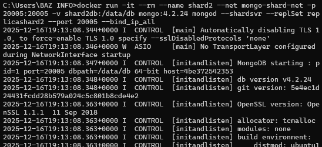

---

### 3.7. Étape 6 — Initialisation du replica set du Shard 2 — *T5*
**Connexion :**
```bash
docker exec -it shard2 mongo --port 20005
```
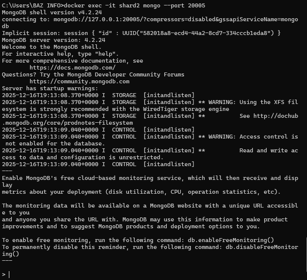

**Initialisation :**
```js
rs.initiate({
  _id: "replicashard2",
  members: [{ _id: 0, host: "shard2:20005" }]
})
```
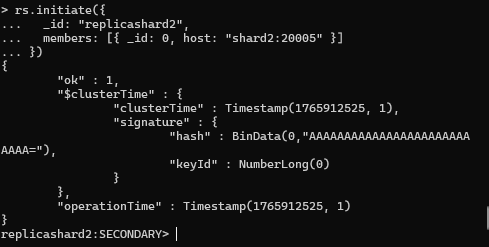

**Vérification :**
```js
rs.status()
exit
```
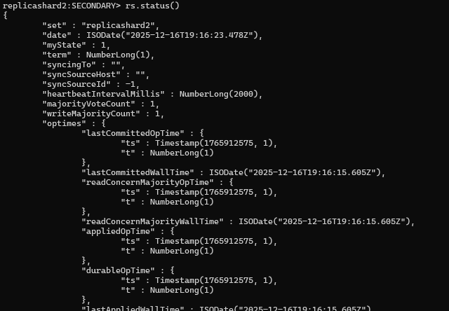

**Résultat attendu :**
- `stateStr: "PRIMARY"` pour `shard2:20005`.


---

### 3.8. Étape 7 — Démarrage du routeur `mongos` — *T4*
**But :**  
Lancer le routeur `mongos` connecté au Config Server. Toutes les opérations de sharding seront réalisées via `mongos`.

**Commande :**
```bash
docker run -it --rm --name mongos --net mongo-shard-net -p 27017:27017 \
  mongo:4.2.24 mongos --configdb replicaconfig/configsvr:27019 --bind_ip_all
```

**Résultat attendu :**
- Attente de connexions sur le port `27017`
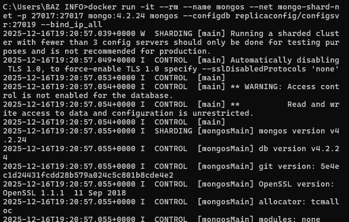
---

## 4. Configuration du sharding (via `mongos`) — *T5*

### 4.1. Connexion à `mongos`
```bash
docker exec -it mongos mongo --port 27017
```
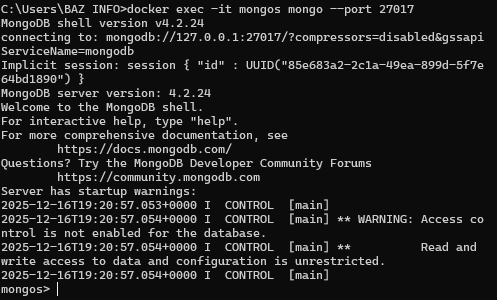

### 4.2. Ajout des shards au cluster
**But :** déclarer les deux shards auprès du cluster shardé.
```js
sh.addShard("replicashard1/shard1:20004")
sh.addShard("replicashard2/shard2:20005")
```
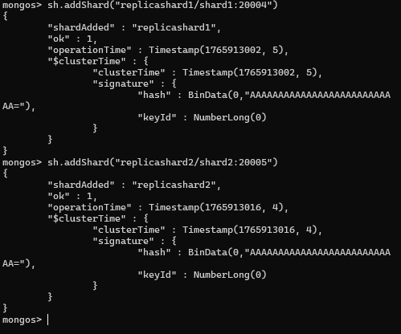

**Vérification :**
```js
sh.status()
```
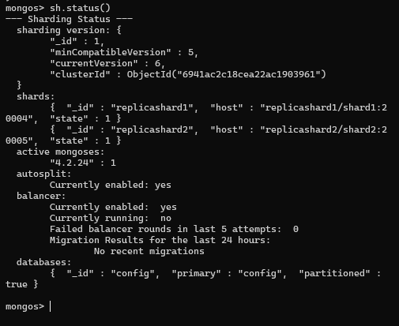

Les deux shards apparaissent dans la configuration du cluster.

---
Après le démarrage du routeur mongos et l’activation du sharding, les logs observés sur le terminal du Config Server (configsvr) affichent de manière répétée des messages liés au Balancer (ex. balancer.round, distributed lock, actionlog, config.system.sessions). Ce comportement est normal.

En effet, le Config Server est responsable de stocker et maintenir les métadonnées du sharding (répartition des chunks, état du cluster, verrous distribués, journal d’actions). Le balancer fonctionne par itérations (“rounds”) : il vérifie périodiquement s’il existe des chunks à déplacer afin d’équilibrer la charge entre shards, puis enregistre ses actions dans la base config. Cela explique la répétition de ces logs sur configsvr.

À l’inverse, les processus des shards (shard1 et shard2) affichent généralement moins de messages à ce stade, car ils sont principalement chargés du stockage des données. Leurs logs deviennent plus visibles lors d’opérations applicatives (inserts/requêtes) ou lors de migrations effectives de données.

### 4.3. Activation du sharding sur une base et shardCollection
**But :**
- activer le sharding sur la base `mabasefilms`
- définir une clé de sharding pour la collection `films` (ici : `{ titre: 1 }`)

```js
sh.enableSharding("mabasefilms")

use mabasefilms
db.films.createIndex({ titre: 1 })

sh.shardCollection("mabasefilms.films", { titre: 1 })
sh.status()
```
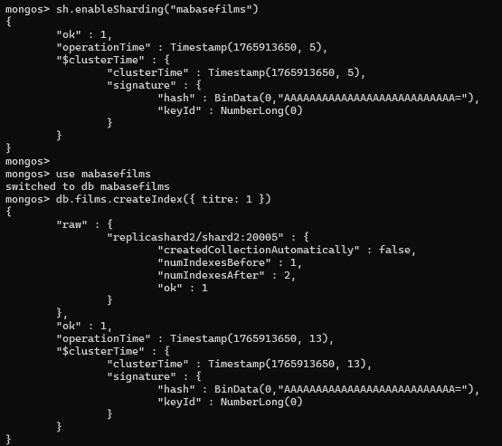
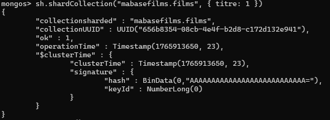


**Justification (index obligatoire) :**  
MongoDB impose un index sur la shard key parce que cette clé sert à décider où stocker et où chercher les données dans le cluster.

Router rapidement (mongos) : quand une requête filtre sur la shard key (ex. titre), mongos peut identifier directement quel(s) shard(s) contiennent les documents concernés. Sans index, il faudrait souvent parcourir beaucoup plus de données, voire interroger tous les shards.

Découper la collection en “chunks” : le sharding fonctionne en découpant la collection en plages de valeurs de la shard key (des chunks). Pour créer et gérer ces plages, MongoDB a besoin de pouvoir trouver rapidement les valeurs et leurs bornes. L’index fournit cette structure triée.

Éviter des opérations coûteuses : sans index, la création des chunks et la distribution des données obligeraient MongoDB à faire des scans complets et répétés, ce qui est inefficace et peut bloquer/ralentir fortement la base.

=>Donc l’index sur la shard key est obligatoire car il rend possible un routage efficace et une gestion correcte des chunks.

Sortie :
```js
exit
```

---

## 5. Vérifications finales

### 5.1. Vérifier les conteneurs actifs
```bash
docker ps
```
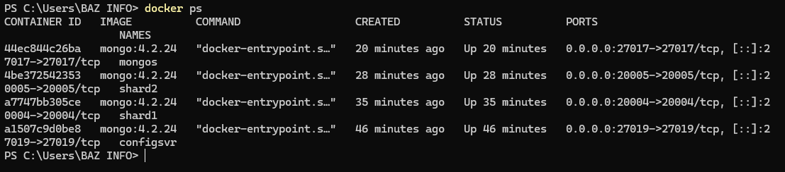
`configsvr`, `shard1`, `shard2`, `mongos` doivent apparaître en “Up”.

### 5.2. Vérifier la configuration du cluster
Depuis le shell connecté à `mongos` :
```js
sh.status()
```
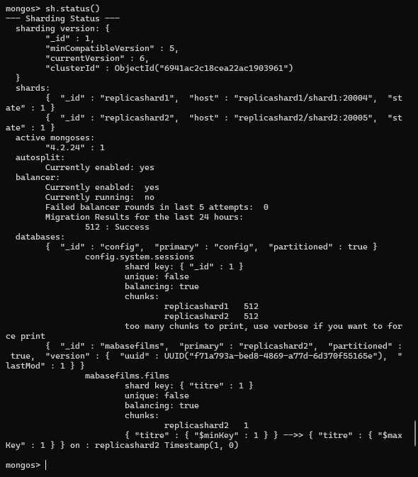

- la liste des shards
- la base `mabasefilms` en sharding activé
- la collection `mabasefilms.films` shardée sur `{ titre: 1 }`

---

## 6. Difficultés rencontrées (à compléter)
- *[Exemple : conflit de port 27017 dû à un conteneur MongoDB standalone déjà présent]*  
- *[Exemple : init replica set requis avant sharding, sinon erreurs ReadConcernMajorityNotAvailableYet]*

---

## 7. Conclusion
Le cluster shardé a été déployé avec succès sous Docker :  
- Config Server initialisé en replica set  
- Deux shards initialisés en replica sets  
- Routeur `mongos` opérationnel  
- Sharding activé sur la base `mabasefilms` et collection `films` shardée par la clé `{ titre: 1 }`.

La suite du TP consiste à insérer un volume de données et à observer la distribution des chunks ainsi que le comportement du balancer.
## Insertion des données dans la collection shardée

### Script d’insertion (Python)
Le TP demande ensuite d’exécuter un script d’insertion qui génère des films aléatoires et les insère dans `mabasefilms.films`.

**Important : point de connexion**
Le script doit se connecter sur :
- `mongodb://localhost:27017/`

Cela correspond au **routeur `mongos`** (et non aux shards directement).  
Ainsi, les insertions passent par le routeur, qui applique les règles de sharding.

**Préparation de l’environnement Python (PowerShell) :**
```powershell
pip install pymongo
```
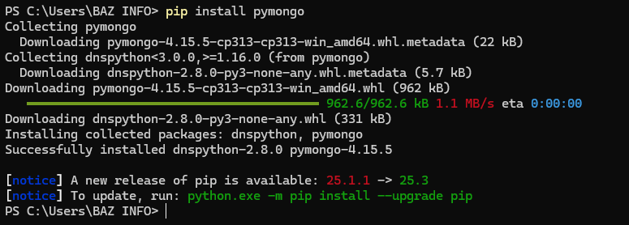

**Exécution du script (dans le dossier où se trouve le `.py`) :**
```powershell
python .\monappunparun.py
```

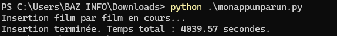

---

## Suivi et observation en temps réel (chunks / balancer)

### 1) Suivi “fonctionnel” : nombre de documents insérés
Pendant l’exécution du script, il est possible de vérifier que la collection se remplit via `mongos`.

Connexion :
```powershell
docker exec -it mongos mongo --port 27017
```

Puis :
```js
use mabasefilms
db.films.countDocuments()
```

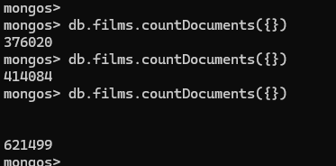

jusqu'a atteindre à la fin :
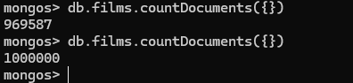

---

### 2) Vérifier la distribution des données par shard
MongoDB permet d’afficher une répartition approximative des données par shard :

```js
use mabasefilms
db.films.getShardDistribution()
```

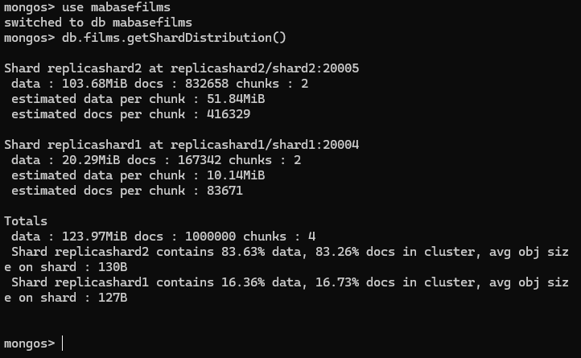

### Interprétation de `db.films.getShardDistribution()`

Chaque bloc **`Shard ...`** correspond à un **serveur de données** (*shard*).  
Dans ce cluster, deux shards sont présents : `replicashard2` et `replicashard1`.

#### Shard `replicashard2`
- **data : 103.68 MiB** : taille totale des données stockées sur ce shard  
- **docs : 832658** : nombre de documents stockés sur ce shard  
- **chunks : 2** : nombre de *chunks* (unités de partitionnement) appartenant à ce shard  

#### Shard `replicashard1`
- **data : 20.29 MiB** : taille totale des données stockées sur ce shard  
- **docs : 167342** : nombre de documents stockés sur ce shard  
- **chunks : 2** : nombre de chunks appartenant à ce shard  

#### Totaux
- **docs : 1 000 000** : le script a inséré un million de documents au total  
- **chunks : 4** : la collection est découpée en 4 chunks au total (2 + 2)

La commande db.films.getShardDistribution() montre que la collection n’est pas uniformément répartie : environ 83% des documents sont stockés sur replicashard2 contre ~17% sur replicashard1. Cette asymétrie est cohérente avec une shard key (titre) ayant une faible cardinalité (peu de valeurs distinctes), ce qui réduit la capacité à distribuer uniformément les chunks.


---

### 3) Observer les chunks (métadonnées de sharding)
Les informations sur les chunks sont stockées côté **config server** (base `config`).

Dans le shell connecté à `mongos` :
```js
use config
db.chunks.countDocuments({ ns: "mabasefilms.films" })
db.chunks.find({ ns: "mabasefilms.films" }).limit(5)
```

- `countDocuments(...)` donne une idée du **nombre total de chunks**.
- `find(...).limit(5)` permet de visualiser quelques chunks (bornes min/max, shard cible, etc.).

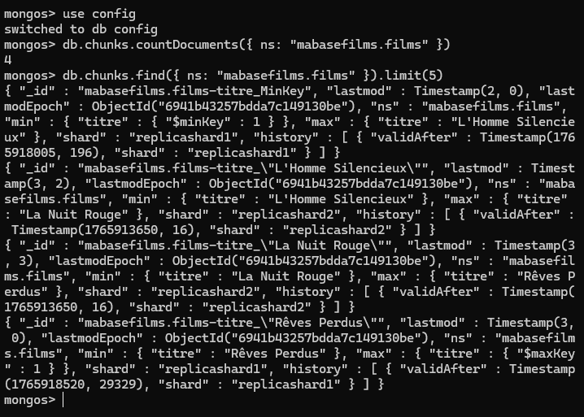

### Analyse de `config.chunks` (collection shardée `mabasefilms.films`)

Les métadonnées du sharding sont stockées dans la base système `config`, notamment dans la collection `config.chunks`.  
Après insertion, l’exécution des commandes suivantes :

```js

db.chunks.countDocuments({ ns: "mabasefilms.films" })
retourne 4.
=> Cela signifie que la collection mabasefilms.films est découpée en 4 chunks (unités de partitionnement/migration).

Ensuite :
db.chunks.find({ ns: "mabasefilms.films" }).limit(5)
affiche les documents représentant les chunks. Chaque chunk contient notamment :

ns : la collection concernée, ici mabasefilms.films.

min et max : les bornes du chunk (intervalle) selon la shard key titre.
Dans les résultats observés, les chunks couvrent des plages successives telles que :

MinKey → "L'Homme Silencieux"
"L'Homme Silencieux" → "La Nuit Rouge"
"La Nuit Rouge" → "Rêves Perdus"
"Rêves Perdus" → MaxKey
shard : le shard qui héberge actuellement le chunk (replicashard1 ou replicashard2).

history : historique du placement du chunk ; validAfter indique depuis quand le chunk est associé au shard courant (utile pour constater d’éventuelles migrations provoquées par le balancer).

Conclusion : la collection mabasefilms.films est bien shardée par la clé { titre: 1 } et partitionnée en 4 chunks correspondant à des plages de valeurs de titre, réparties entre les deux shards. Cette observation confirme le mécanisme de sharding par intervalles (ranged sharding) et permet de suivre la distribution et les migrations éventuelles des chunks.


---

### 4) Surveiller le balancer (équilibrage)
Le **balancer** est le mécanisme qui déplace des chunks entre shards pour équilibrer la charge.

Toujours via `mongos` :
```js
sh.getBalancerState()
sh.isBalancerRunning()
```

- `sh.getBalancerState()` : indique si le balancer est activé.
- `sh.isBalancerRunning()` : indique s’il est actuellement en activité.

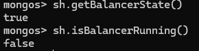


---

### 5) Suivi par logs Docker (niveau “système”)
Pour voir en direct des traces liées au balancer/migrations, il est possible de suivre les logs :

**Logs du config server :**
```powershell
docker logs -f configsvr
```

**Logs du routeur :**
```powershell
docker logs -f mongos
```

Ces logs peuvent contenir des messages répétitifs liés au balancer (rounds), aux verrous distribués, et à des migrations internes (ex. `config.system.sessions`). Ceci est un comportement normal dans un cluster shardé actif.

---

## Remarque “production” 
Le script insère des documents **un par un** (insertion unitaire).  
Dans un contexte de production, une insertion massive se ferait plutôt avec des insertions en lot (**batch insert**) afin de réduire :
- le coût réseau
- la surcharge d’acknowledgement
- le temps total d’ingestion

De plus, le TP mentionne qu’il peut être pertinent d’ajuster la **taille des chunks** car la taille d’un chunk influence directement les performances et la manière dont le cluster s’équilibre.

- Un **chunk** est l’unité que MongoDB peut **déplacer** d’un shard à un autre. Le balancer ne déplace pas des documents un par un : il déplace des **chunks entiers**.
- Si la **taille des chunks est trop petite**, MongoDB va créer **beaucoup de chunks** :
  - métadonnées plus volumineuses côté `config` (plus de gestion)
  - plus d’opérations de split/migration possibles
  - surcoût administratif (balancer plus sollicité), surtout pendant de fortes insertions
- Si la **taille des chunks est trop grande**, il y aura **peu de chunks** :
  - l’équilibrage devient moins fin (difficile de répartir “progressivement” les données)
  - une migration peut être plus lourde (déplacer un chunk volumineux consomme du réseau et du temps)
  - le balancer peut réagir plus lentement aux déséquilibres

Ainsi, le choix de la taille des chunks dépend du **volume** et du **modèle de charge** :
- pour des insertions massives et un fort débit, une taille adaptée évite une multiplication excessive des splits et migrations ;
- pour une distribution plus fine et un équilibrage plus progressif, une taille pas trop grande permet de déplacer des morceaux de données plus facilement.

En résumé, ajuster la taille des chunks permet de trouver un compromis entre :
- **coût de gestion** (nombre de chunks)  
et  
- **granularité de l’équilibrage** (facilité et fréquence des migrations du balancer).

---


# Questions / Réponses 

---

## 1) Qu’est-ce que le sharding dans MongoDB et pourquoi est-il utilisé ?
Le **sharding** est un **partitionnement horizontal** : MongoDB découpe une collection en plusieurs parties et les répartit sur plusieurs serveurs appelés **shards**.  
Il est utilisé pour :
- **augmenter la capacité de stockage** (plus de données qu’un seul serveur),
- **augmenter les performances** (répartir les lectures/écritures),
- **scaler horizontalement** (ajouter des shards au lieu d’acheter une machine plus puissante).

---

## 2) Quelle est la différence entre le sharding et la réplication dans MongoDB ?
- **Réplication (replica set)** : plusieurs serveurs contiennent **la même donnée**. Objectif : **haute disponibilité** et tolérance aux pannes.
- **Sharding** : plusieurs serveurs contiennent **des parties différentes** de la donnée. Objectif : **scalabilité** (volume + charge).

=> On peut combiner les deux : *un cluster shardé où chaque shard est un replica set*.

---

## 3) Quels sont les composants d’une architecture shardée (mongos, config servers, shards) ?
- **Shards** : serveurs qui stockent réellement les données.
- **Config servers (CSRS)** : stockent les **métadonnées** du sharding (où sont les chunks, configuration, etc.).
- **mongos** : **routeur** ; point d’entrée des clients, il route les requêtes vers le bon shard.

---

## 4) Quelles sont les responsabilités des config servers (CSRS) dans un cluster shardé ?
Les **config servers** stockent la base `config` (métadonnées), notamment :
- la liste des shards,
- la configuration des bases/collections shardées,
- la liste des **chunks** et leur emplacement,
- l’historique des migrations, et certaines informations nécessaires au balancer.

Sans CSRS opérationnels, le routage et certaines opérations de maintenance (split/migration) deviennent impossibles ou limitées.

---

## 5) Quel est le rôle du mongos router ?
`mongos` est le **point d’entrée** du cluster :
- il reçoit les requêtes des clients,
- il consulte les métadonnées (config servers),
- il envoie la requête au(x) shard(s) concerné(s),
- il regroupe les résultats si plusieurs shards sont impliqués.

---

## 6) Comment MongoDB décide-t-il sur quel shard stocker un document ?
MongoDB regarde la **valeur de la shard key** dans le document :
1. il détermine dans quel **chunk** (plage de valeurs) cette valeur tombe,
2. ce chunk est associé à un shard,
3. le document est stocké sur ce shard.

---

## 7) Qu’est-ce qu’une clé de sharding et pourquoi est-elle essentielle ?
La **clé de sharding** (*shard key*) est le champ (ou ensemble de champs) utilisé pour **partitionner** une collection.  
Elle est essentielle car elle influence :
- la **répartition** des données entre shards,
- le **routage** des requêtes (un bon routage évite de contacter tous les shards),
- le risque de **déséquilibre** (hot shard) et les performances globales.

---

## 8) Quels sont les critères de choix d’une bonne clé de sharding ?
Une bonne shard key doit idéalement :
- avoir une **forte cardinalité** (beaucoup de valeurs différentes),
- bien **répartir** les écritures (éviter qu’un shard reçoive tout),
- être **souvent utilisée dans les requêtes** (filtres), pour éviter les requêtes multi-shards,
- éviter les clés **monotones** (dates/compteurs strictement croissants) si cela concentre les insertions,
- rester **stable** (ne pas nécessiter de changer la clé plus tard : c’est très coûteux).

---

## 9) Qu’est-ce qu’un chunk dans MongoDB ?
Un **chunk** est une “unité” de données dans le sharding :  
c’est une **plage de valeurs** de shard key (ex. de `min` à `max`) que MongoDB peut **déplacer** entre shards pour équilibrer le cluster.

---

## 10) Comment fonctionne le splitting des chunks ?
Quand un chunk devient trop “gros” (au-delà de la taille cible), MongoDB peut le **split** :
- il choisit une valeur de shard key comme point de coupure,
- il découpe le chunk en **deux chunks plus petits**,
- cela permet ensuite au balancer de déplacer plus facilement des parties de données.

---

## 11) Que fait le balancer dans un cluster shardé ?
Le **balancer** est le mécanisme d’**équilibrage** :
- il surveille la répartition des chunks,
- il déclenche des **migrations de chunks** si un shard est trop chargé par rapport aux autres,
- l’objectif est de maintenir une distribution plus homogène.

---

## 12) Quand et comment le balancer déplace-t-il des chunks ?
Le balancer fonctionne par cycles (“rounds”) :
- il compare la distribution des chunks entre shards,
- s’il détecte un déséquilibre significatif, il choisit des chunks “candidats”,
- il migre ces chunks du shard “trop chargé” vers un shard “moins chargé”.

Pendant une migration :
- les données du chunk sont copiées vers le shard cible,
- puis un basculement final est fait pour que le chunk appartienne au shard cible.

---

## 13) Qu’est-ce qu’un hot shard et comment l’éviter ?
Un **hot shard** est un shard qui reçoit **beaucoup plus** de charge (écritures/lectures) que les autres.  
Causes fréquentes :
- shard key mal choisie,
- shard key monotone,
- application qui requête toujours une seule plage.

Pour l’éviter :
- choisir une shard key plus **dispersée** (ou hashed),
- éviter les clés monotones,
- prévoir des index adaptés et une stratégie de requêtes ciblées.

---

## 14) Quels problèmes une clé de sharding monotone peut-elle engendrer ?
Une clé monotone (ex : timestamp croissant, compteur) fait que les nouveaux documents arrivent toujours “à la fin” de l’intervalle :
- les nouvelles insertions tombent dans les mêmes chunks récents,
- ces chunks récents sont souvent sur un même shard,
=> cela crée un **hot shard**, un déséquilibre et des performances dégradées.

---

## 15) Comment activer le sharding sur une base de données et sur une collection ?
Ces commandes se font via **mongos** :

1) Activer le sharding sur la base :
```js
sh.enableSharding("maBase")
```

2) Créer l’index sur la shard key (obligatoire) :
```js
use maBase
db.maColl.createIndex({ maShardKey: 1 })
```

3) Sharder la collection :
```js
sh.shardCollection("maBase.maColl", { maShardKey: 1 })
```

---

## 16) Comment ajouter un nouveau shard à un cluster MongoDB ?
Via **mongos** :
```js
sh.addShard("nomReplicaSet/host:port")
```
Ensuite, le balancer pourra progressivement répartir des chunks vers ce nouveau shard.

---

## 17) Comment vérifier l’état du cluster shardé (commandes usuelles) ?
Commandes utiles (via **mongos**) :
- `sh.status()` : état global du sharding, shards, bases/collections shardées
- `db.collection.getShardDistribution()` : distribution par shard (approx.)
- `sh.getBalancerState()` : balancer activé ou non
- `sh.isBalancerRunning()` : balancer en cours d’exécution ou non

Et côté Docker :
- `docker ps` : conteneurs actifs
- `docker logs -f <container>` : logs temps réel

---

## 18) Dans quels cas faut-il envisager d’utiliser un hashed sharding key ?
On envisage une shard key **hashed** quand on veut :
- une **distribution uniforme** des insertions,
- éviter un hot shard (cas clé monotone),
- répartir la charge d’écriture de façon plus régulière.

Limite : les requêtes par **intervalle** (range queries) sont moins efficaces, car le hash casse l’ordre naturel.

---

## 19) Dans quels cas faut-il privilégier un ranged sharding key ?
Une shard key **ranged** est utile quand on fait souvent des requêtes par **plage** sur la shard key  
(ex : requêtes “entre deux dates”, tri naturel, analyses par intervalle).  
Avantage : MongoDB peut cibler un intervalle de chunks.

Risque : si la clé est monotone et que l’écriture se fait toujours sur la “fin”, on peut créer un hot shard.

---

## 20) Qu’est-ce que le zone sharding et quel est son intérêt ?
Le **zone sharding** permet d’associer des **plages de shard key** à des **shards spécifiques** (zones).  
Intérêts :
- forcer certaines données à rester sur certains shards (ex : réglementation, région, datacenter),
- mieux contrôler la localisation des données,
- mieux répartir selon des contraintes métier.

---

## 21) Comment MongoDB gère-t-il les requêtes multi-shards ?
Si une requête ne peut pas être ciblée sur un seul shard (pas de filtre shard key, ou filtre trop large) :
- `mongos` envoie la requête à **plusieurs shards** (scatter),
- récupère les résultats,
- puis **fusionne** / agrège les résultats (gather).

Cela coûte plus cher (plus de réseau + plus de temps).

---

## 22) Comment optimiser les performances de requêtes dans un environnement shardé ?
Bonnes pratiques :
- requêter **avec la shard key** (ou un préfixe de la shard key si elle est composée),
- créer des **index** adaptés (filtres + tri + shard key),
- éviter les requêtes “sans filtre” sur de grosses collections (multi-shards),
- limiter les retours (projection), paginer, éviter les scans complets,
- surveiller la distribution des chunks et ajuster la stratégie (shard key / zones / batch inserts).

---

## 23) Que se passe-t-il lorsqu’un shard devient indisponible ?
Cela dépend de la configuration :
- Si le shard est un **replica set** et qu’un PRIMARY tombe, un SECONDARY peut devenir PRIMARY (continuité possible).
- Si le shard devient totalement indisponible, les données stockées sur ce shard deviennent **inaccessibles** :  
  les requêtes qui doivent toucher ce shard échouent ou restent bloquées selon les timeouts.

---

## 24) Comment migrer une collection existante vers un schéma shardé ?
Étapes générales (via `mongos`) :
1. Choisir la shard key (très important).
2. Créer l’index sur la shard key.
3. Activer sharding sur la base (`sh.enableSharding`).
4. Sharder la collection (`sh.shardCollection`).
5. Laisser MongoDB effectuer splits/migrations (balancer).  
   On peut surveiller `sh.status()`, `config.chunks`, distribution, etc.

---

## 25) Quels outils ou métriques utiliser pour diagnostiquer les problèmes de sharding ?
Outils/commandes utiles :
- `sh.status()` (vue globale)
- `db.collection.getShardDistribution()` (répartition)
- `config.chunks`, `config.collections` (métadonnées)
- `sh.getBalancerState()`, `sh.isBalancerRunning()`
- logs `mongos` / `configsvr` / shards
- monitoring : CPU, RAM, IO disque, latence des requêtes, connexions, taille des collections, débit d’écriture/lecture, temps de migration, déséquilibre de chunks.

---

