# TP — Introduction à MapReduce avec MongoDB (collection des films)

Ce document répond **à toutes les questions** de l’énoncé “Introduction à MapReduce avec MongoDB” en se basant sur **la collection de films** du TP1 

---

## 0) Pré-requis et rappel sur les données

### 0.1 Structure d’un document “film” 

Chaque film ressemble à ceci (schéma simplifié) :
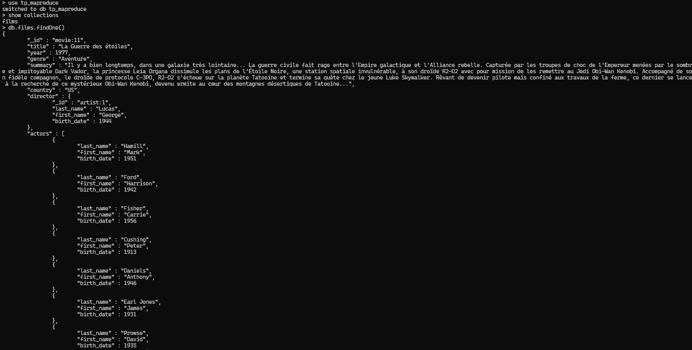
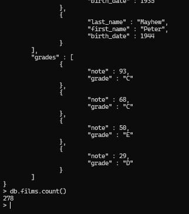


### 0.2 Import

Exemple :

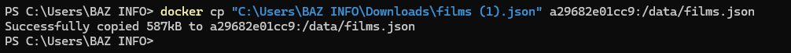
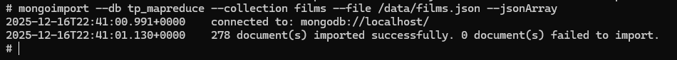

Ensuite dans `mongosh` : (voir capture ci-dessus)

```js
use tp_nosql
db.films.countDocuments()
```

---

---

# 1) Compter le nombre total de films dans la collection

### Map / Reduce

```js
var map1 = function () {
  emit("total_films", 1);
};

var reduce1 = function (key, values) {
  return Array.sum(values);
};
```

### Exécution

```js
db.films.mapReduce(map1, reduce1, { out: "mr_q1_total_films" });
db.mr_q1_total_films.find();
```
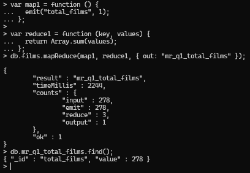

---

# 2) Compter le nombre de films par genre

```js
var map2 = function () {
  emit(this.genre || "UNKNOWN", 1);
};

var reduce2 = function (key, values) {
  return Array.sum(values);
};

db.films.mapReduce(map2, reduce2, { out: "mr_q2_films_par_genre" });
db.mr_q2_films_par_genre.find().sort({ value: -1 });
```
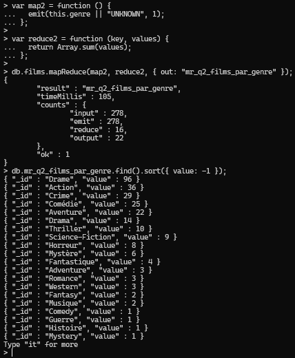

---

# 3) Compter le nombre de films réalisés par chaque réalisateur

Ici on compte par **identifiant réalisateur** et on garde un libellé lisible.

```js
var map3 = function () {
  var d = this.director || {};
  var key = (d && d._id) ? d._id : "director:unknown";

  var fn = (d && d.first_name) ? d.first_name : "";
  var ln = (d && d.last_name)  ? d.last_name  : "";
  var name = (fn + " " + ln).trim() || "Unknown";

  emit(key, { count: 1, name: name });
};

var reduce3 = function (key, values) {
  var total = 0;
  var name = null;
  values.forEach(function (v) {
    total += (v.count || 0);
    if (!name && v.name) name = v.name;
  });
  return { count: total, name: name };
};

db.films.mapReduce(map3, reduce3, { out: "mr_q3_films_par_realisateur" });
db.mr_q3_films_par_realisateur.find().sort({ "value.count": -1 });
```
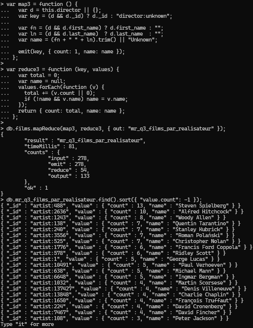

---

# 4) Compter le nombre d’acteurs uniques apparaissant dans tous les films

Principe : on émet une clé par acteur, puis on réduit à 1 (présence).  
Le nombre d’acteurs uniques = nombre de documents dans la collection de sortie.

```js
var map4 = function () {
  if (!this.actors) return;
  for (var i = 0; i < this.actors.length; i++) {
    var a = this.actors[i] || {};
    var fn = a.first_name || "";
    var ln = a.last_name  || "";
    var bd = (a.birth_date !== undefined) ? a.birth_date : "";
    var k  = (fn + " " + ln).trim() + "|" + bd;

    emit(k, 1);
  }
};

var reduce4 = function (key, values) {
  // peu importe combien de fois on l'a vu, on veut "présence"
  return 1;
};

db.films.mapReduce(map4, reduce4, { out: "mr_q4_acteurs_uniques" });

// Résultat : nombre d'acteurs uniques
db.mr_q4_acteurs_uniques.countDocuments();

// Pour voir quelques acteurs
db.mr_q4_acteurs_uniques.find().limit(20);
```
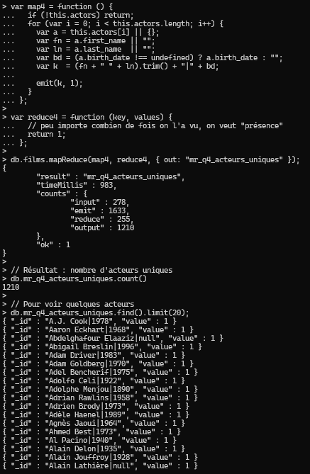

---

# 5) Lister le nombre de films par année de sortie

```js
var map5 = function () {
  emit(this.year || "UNKNOWN", 1);
};

var reduce5 = function (key, values) {
  return Array.sum(values);
};

db.films.mapReduce(map5, reduce5, { out: "mr_q5_films_par_annee" });
db.mr_q5_films_par_annee.find().sort({ _id: 1 });
```
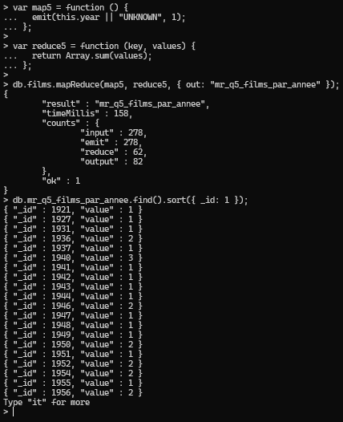

---

# 6) Calculer la note moyenne par film à partir du tableau `grades`

On calcule la moyenne des `note` dans `grades` pour chaque film.

```js
var map6 = function () {
  var sum = 0, cnt = 0;
  if (this.grades) {
    for (var i = 0; i < this.grades.length; i++) {
      var n = this.grades[i].note;
      if (typeof n === "number") { sum += n; cnt += 1; }
    }
  }
  emit(this._id, { sum: sum, cnt: cnt, title: this.title, year: this.year });
};

var reduce6 = function (key, values) {
  var sum = 0, cnt = 0;
  var title = null, year = null;
  values.forEach(function (v) {
    sum += (v.sum || 0);
    cnt += (v.cnt || 0);
    if (!title && v.title) title = v.title;
    if (year === null && v.year !== undefined) year = v.year;
  });
  return { sum: sum, cnt: cnt, title: title, year: year };
};

var finalize6 = function (key, reducedVal) {
  var avg = (reducedVal.cnt > 0) ? (reducedVal.sum / reducedVal.cnt) : null;
  reducedVal.avg = avg;
  return reducedVal;
};

db.films.mapReduce(map6, reduce6, { out: "mr_q6_note_moy_par_film", finalize: finalize6 });

// Exemple : top 10 films par moyenne
db.mr_q6_note_moy_par_film.find().sort({ "value.avg": -1 }).limit(10);
```
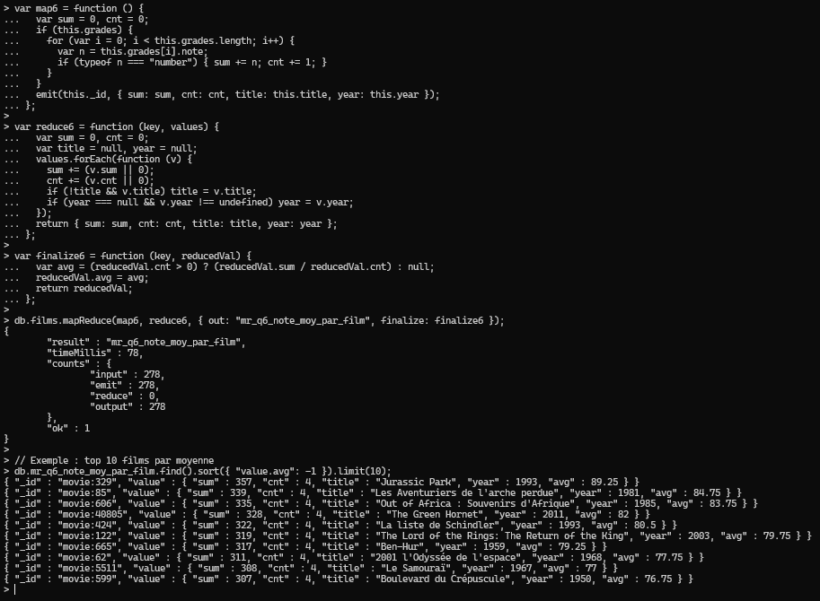

---

# 7) Calculer la note moyenne par genre

Ici on calcule la moyenne des notes (toutes les notes de tous les films du genre).

```js
var map7 = function () {
  var g = this.genre || "UNKNOWN";

  var sum = 0, cnt = 0;
  if (this.grades) {
    for (var i = 0; i < this.grades.length; i++) {
      var n = this.grades[i].note;
      if (typeof n === "number") { sum += n; cnt += 1; }
    }
  }

  emit(g, { sum: sum, cnt: cnt });
};

var reduce7 = function (key, values) {
  var sum = 0, cnt = 0;
  values.forEach(function (v) {
    sum += (v.sum || 0);
    cnt += (v.cnt || 0);
  });
  return { sum: sum, cnt: cnt };
};

var finalize7 = function (key, reducedVal) {
  reducedVal.avg = (reducedVal.cnt > 0) ? (reducedVal.sum / reducedVal.cnt) : null;
  return reducedVal;
};

db.films.mapReduce(map7, reduce7, { out: "mr_q7_note_moy_par_genre", finalize: finalize7 });
db.mr_q7_note_moy_par_genre.find().sort({ "value.avg": -1 });
```
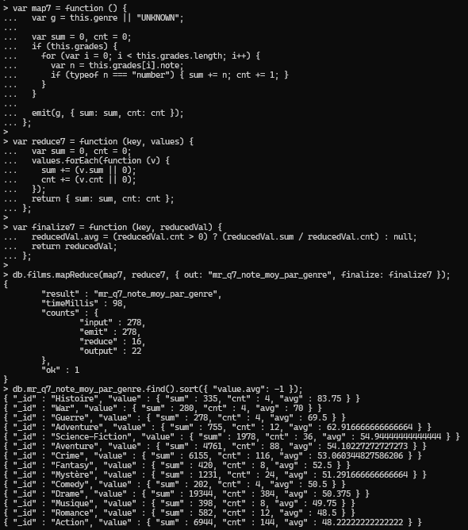

---

# 8) Calculer la note moyenne par réalisateur

Même idée que Q7, mais par réalisateur.

```js
var map8 = function () {
  var d = this.director || {};
  var key = (d && d._id) ? d._id : "director:unknown";

  var fn = (d && d.first_name) ? d.first_name : "";
  var ln = (d && d.last_name)  ? d.last_name  : "";
  var label = (fn + " " + ln).trim() || "Unknown";

  var sum = 0, cnt = 0;
  if (this.grades) {
    for (var i = 0; i < this.grades.length; i++) {
      var n = this.grades[i].note;
      if (typeof n === "number") { sum += n; cnt += 1; }
    }
  }

  emit(key, { sum: sum, cnt: cnt, name: label });
};

var reduce8 = function (key, values) {
  var sum = 0, cnt = 0, name = null;
  values.forEach(function (v) {
    sum += (v.sum || 0);
    cnt += (v.cnt || 0);
    if (!name && v.name) name = v.name;
  });
  return { sum: sum, cnt: cnt, name: name };
};

var finalize8 = function (key, reducedVal) {
  reducedVal.avg = (reducedVal.cnt > 0) ? (reducedVal.sum / reducedVal.cnt) : null;
  return reducedVal;
};

db.films.mapReduce(map8, reduce8, { out: "mr_q8_note_moy_par_realisateur", finalize: finalize8 });

// Top réalisateurs
db.mr_q8_note_moy_par_realisateur.find().sort({ "value.avg": -1 }).limit(20);
```
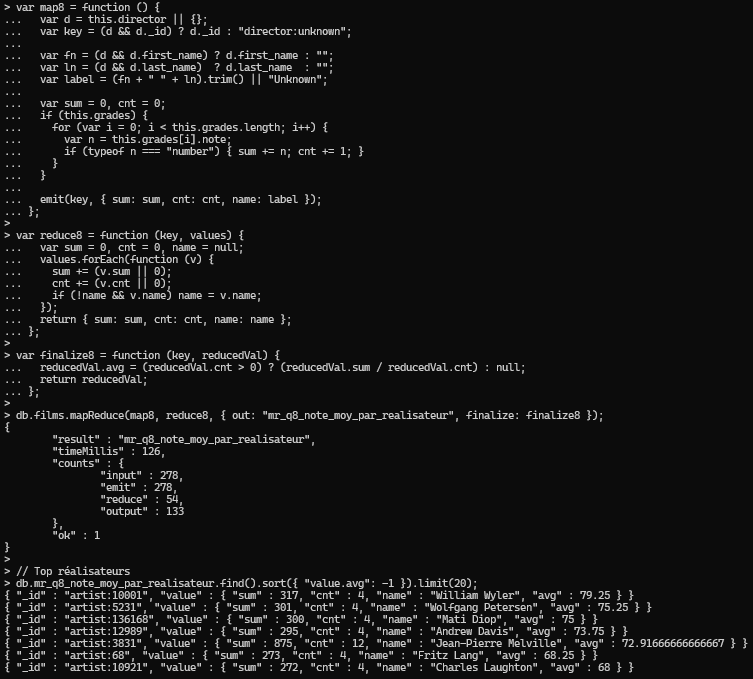

---

# 9) Trouver le film avec la note maximale la plus élevée

On cherche le film dont la moyenne de note (issue de `grades`) est maximale.

Étape simple : réutiliser `mr_q6_note_moy_par_film` et prendre le max.

```js
db.mr_q6_note_moy_par_film.find().sort({ "value.avg": -1 }).limit(1);
```
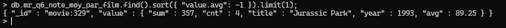

Option 100% MapReduce (1 seul résultat) :

```js
var map9 = function () {
  var sum = 0, cnt = 0;
  if (this.grades) {
    for (var i = 0; i < this.grades.length; i++) {
      var n = this.grades[i].note;
      if (typeof n === "number") { sum += n; cnt += 1; }
    }
  }
  var avg = (cnt > 0) ? (sum / cnt) : null;
  emit("best_movie", { title: this.title, year: this.year, avg: avg });
};

var reduce9 = function (key, values) {
  var best = null;
  values.forEach(function (v) {
    if (!best || (v.avg !== null && v.avg > best.avg)) best = v;
  });
  return best;
};

db.films.mapReduce(map9, reduce9, { out: "mr_q9_best_movie" });
db.mr_q9_best_movie.find();
```
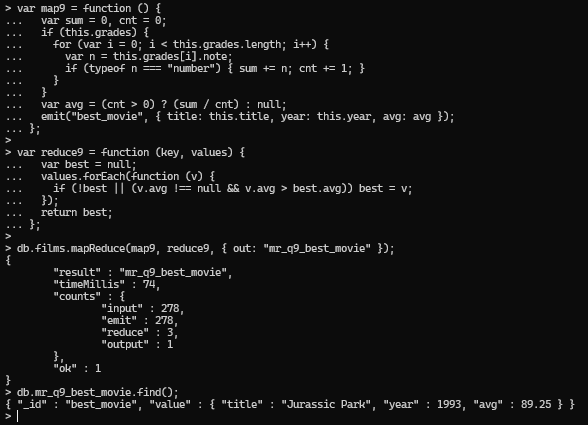

---

# 10) Compter le nombre de notes supérieures à 70 dans tous les films

```js
var map10 = function () {
  var c = 0;
  if (this.grades) {
    for (var i = 0; i < this.grades.length; i++) {
      if (this.grades[i].note > 70) c += 1;
    }
  }
  emit("notes_sup_70", c);
};

var reduce10 = function (key, values) {
  return Array.sum(values);
};

db.films.mapReduce(map10, reduce10, { out: "mr_q10_notes_sup_70" });
db.mr_q10_notes_sup_70.find();
```
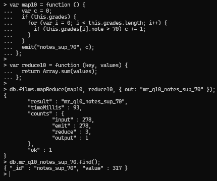

---

# 11) Lister tous les acteurs par genre, sans doublons

Ici on veut, pour chaque genre, la liste des acteurs uniques.

```js
var map11 = function () {
  var g = this.genre || "UNKNOWN";
  if (!this.actors) return;

  // on émet un petit ensemble d'acteurs (liste) par film
  var uniq = {};
  for (var i = 0; i < this.actors.length; i++) {
    var a = this.actors[i] || {};
    var fn = a.first_name || "";
    var ln = a.last_name  || "";
    var bd = (a.birth_date !== undefined) ? a.birth_date : "";
    var k  = (fn + " " + ln).trim() + "|" + bd;

    uniq[k] = true;
  }
  emit(g, { actors: Object.keys(uniq) });
};

var reduce11 = function (key, values) {
  var set = {};
  values.forEach(function (v) {
    if (!v.actors) return;
    for (var i = 0; i < v.actors.length; i++) {
      set[v.actors[i]] = true;
    }
  });
  return { actors: Object.keys(set) };
};

db.films.mapReduce(map11, reduce11, { out: "mr_q11_acteurs_par_genre" });

// Exemple : voir le genre "Drama"
db.mr_q11_acteurs_par_genre.find({ _id: "Drama" });

// Tous les genres
db.mr_q11_acteurs_par_genre.find();
```
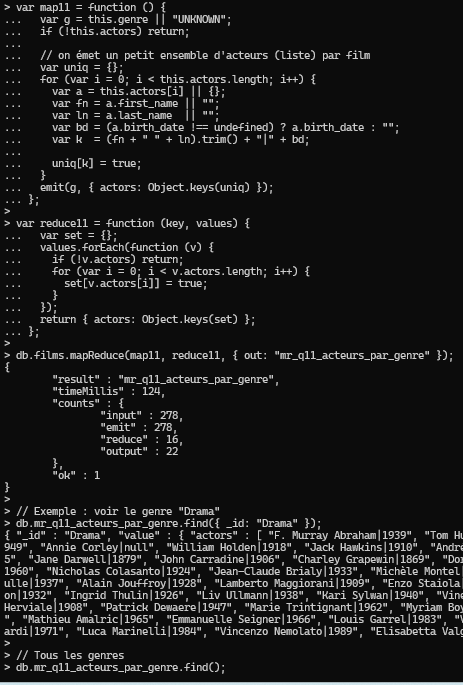

---

# 12) Trouver les acteurs apparaissant dans le plus grand nombre de films

Étape 1 : compter, pour chaque acteur, dans combien de films il apparaît.

```js
var map12 = function () {
  if (!this.actors) return;

  // IMPORTANT : un acteur doit compter 1 fois par film (même s'il est répété, ce qui n'arrive pas ici)
  var uniq = {};
  for (var i = 0; i < this.actors.length; i++) {
    var a = this.actors[i] || {};
    var fn = a.first_name || "";
    var ln = a.last_name  || "";
    var bd = (a.birth_date !== undefined) ? a.birth_date : "";
    var k  = (fn + " " + ln).trim() + "|" + bd;

    uniq[k] = true;
  }

  Object.keys(uniq).forEach(function (k) {
    emit(k, 1);
  });
};

var reduce12 = function (key, values) {
  return Array.sum(values);
};

db.films.mapReduce(map12, reduce12, { out: "mr_q12_nb_films_par_acteur" });
```


Étape 2 : prendre le maximum.

```js
// acteur(s) avec le plus de films (1er)
db.mr_q12_nb_films_par_acteur.find().sort({ value: -1 }).limit(10);
```
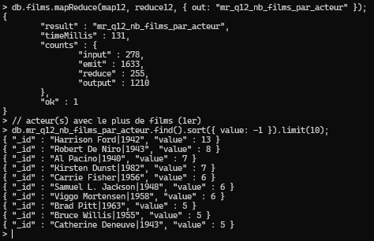

---

# 13) Classer les films par lettre de grade majoritaire (A, B, C, ...)

Interprétation : pour chaque film, on regarde la lettre `grade` la plus fréquente dans `grades`,
puis on classe les films par cette lettre (liste de titres par lettre).

```js
var map13 = function () {
  if (!this.grades || this.grades.length === 0) return;

  var counts = {};
  for (var i = 0; i < this.grades.length; i++) {
    var gr = this.grades[i].grade || "UNKNOWN";
    counts[gr] = (counts[gr] || 0) + 1;
  }

  // trouver la lettre majoritaire
  var best = null;
  for (var k in counts) {
    if (!best || counts[k] > counts[best]) best = k;
  }

  emit(best, { titles: [this.title] });
};

var reduce13 = function (key, values) {
  // concat de listes (attention : peut devenir gros sur très grandes bases)
  var all = [];
  values.forEach(function (v) {
    if (v.titles) all = all.concat(v.titles);
  });
  return { titles: all };
};

db.films.mapReduce(map13, reduce13, { out: "mr_q13_films_par_grade_majoritaire" });

// Exemple : films dont la lettre majoritaire est "A"
db.mr_q13_films_par_grade_majoritaire.find({ _id: "A" });
```
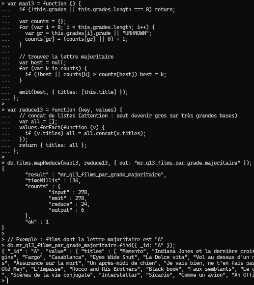

---

# 14) Calculer la note moyenne par année de sortie des films

Moyenne des notes (toutes les notes de tous les films sortis la même année).

```js
var map14 = function () {
  var y = this.year || "UNKNOWN";

  var sum = 0, cnt = 0;
  if (this.grades) {
    for (var i = 0; i < this.grades.length; i++) {
      var n = this.grades[i].note;
      if (typeof n === "number") { sum += n; cnt += 1; }
    }
  }

  emit(y, { sum: sum, cnt: cnt });
};

var reduce14 = function (key, values) {
  var sum = 0, cnt = 0;
  values.forEach(function (v) {
    sum += (v.sum || 0);
    cnt += (v.cnt || 0);
  });
  return { sum: sum, cnt: cnt };
};

var finalize14 = function (key, reducedVal) {
  reducedVal.avg = (reducedVal.cnt > 0) ? (reducedVal.sum / reducedVal.cnt) : null;
  return reducedVal;
};

db.films.mapReduce(map14, reduce14, { out: "mr_q14_note_moy_par_annee", finalize: finalize14 });
db.mr_q14_note_moy_par_annee.find().sort({ _id: 1 });
```
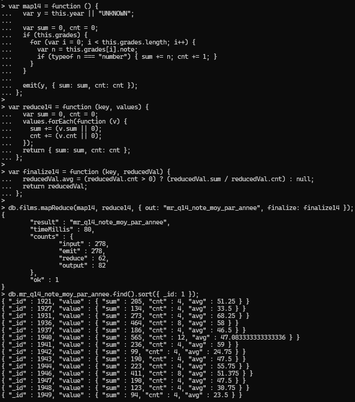

---

# 15) Identifier les réalisateurs dont la note moyenne (sur tous leurs films) est supérieure à 80

On réutilise directement le résultat de Q8 : `mr_q8_note_moy_par_realisateur`.

```js
db.mr_q8_note_moy_par_realisateur.find({ "value.avg": { $gt: 80 } })
  .sort({ "value.avg": -1 });
```

Si on veut tout faire “en 1 MapReduce”, vous pouvez simplement exécuter Q8 puis filtrer comme ci-dessus.
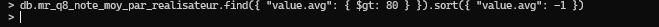

---

## Annexe — Nettoyage 


```js
db.mr_q1_total_films.drop();
db.mr_q2_films_par_genre.drop();
db.mr_q3_films_par_realisateur.drop();
db.mr_q4_acteurs_uniques.drop();
db.mr_q5_films_par_annee.drop();
db.mr_q6_note_moy_par_film.drop();
db.mr_q7_note_moy_par_genre.drop();
db.mr_q8_note_moy_par_realisateur.drop();
db.mr_q9_best_movie.drop();
db.mr_q10_notes_sup_70.drop();
db.mr_q11_acteurs_par_genre.drop();
db.mr_q12_nb_films_par_acteur.drop();
db.mr_q13_films_par_grade_majoritaire.drop();
db.mr_q14_note_moy_par_annee.drop();
```

---

## Conclusion

Ce TP permet de pratiquer MapReduce dans MongoDB sur une collection “films” en manipulant :
- des **compteurs** (total, par genre, par année, par réalisateur),
- des **distinct** (acteurs uniques),
- des **agrégations** (moyennes de notes),
- des **classements** (meilleurs films, acteurs les plus présents, films par grade majoritaire).

